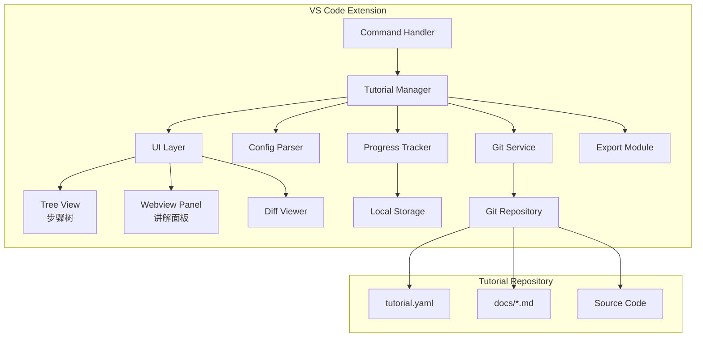

# Design Document

## Overview

交互式教程系统是一个 VS Code 插件，通过 Git 版本控制实现教程步骤的流转。系统采用模块化架构，核心模块包括：教程管理器、Git 操作层、Diff 查看器、讲解面板、进度追踪器和导出模块。

技术栈：
- VS Code Extension API + TypeScript
- simple-git 库处理 Git 操作
- Webview 渲染讲解内容和 Diff 视图
- VS Code 内置 Diff Editor 展示代码差异

## Architecture



### 数据流

1. 用户通过命令面板触发"打开教程"
2. Tutorial Manager 调用 Config Parser 解析配置
3. Tree View 渲染步骤树
4. 用户点击步骤节点 → Git Service 执行 checkout
5. Diff Viewer 计算并展示差异
6. Webview Panel 加载对应的讲解内容
7. Progress Tracker 更新并持久化进度

## Components and Interfaces

### 1. Tutorial Manager (核心协调器)

```typescript
interface ITutorialManager {
  // 加载教程
  loadTutorial(source: string): Promise<Tutorial>;
  
  // 获取当前教程
  getCurrentTutorial(): Tutorial | undefined;
  
  // 切换到指定步骤
  navigateToStep(stepId: string): Promise<void>;
  
  // 获取当前步骤
  getCurrentStep(): StepNode | undefined;
  
  // 关闭教程
  closeTutorial(): Promise<void>;
}

interface Tutorial {
  id: string;
  name: string;
  description: string;
  rootPath: string;
  steps: StepNode[];
  currentStepId: string | null;
}

interface StepNode {
  id: string;
  title: string;
  description: string;
  gitRef: string;           // commit hash 或 tag
  parentId: string | null;  // 支持分支结构
  children: string[];       // 子步骤 ID 列表
  explanationPath: string;  // 讲解文件路径
}
```

### 2. Git Service (Git 操作层)

```typescript
interface IGitService {
  // 克隆仓库
  clone(url: string, targetPath: string): Promise<void>;
  
  // 检出到指定引用
  checkout(ref: string): Promise<void>;
  
  // 获取两个引用之间的 diff
  getDiff(fromRef: string, toRef: string): Promise<FileDiff[]>;
  
  // 检查是否有未提交的修改
  hasUncommittedChanges(): Promise<boolean>;
  
  // 暂存当前修改
  stash(): Promise<void>;
  
  // 恢复暂存的修改
  stashPop(): Promise<void>;
}

interface FileDiff {
  filePath: string;
  status: 'added' | 'modified' | 'deleted' | 'renamed';
  additions: number;
  deletions: number;
  hunks: DiffHunk[];
}

interface DiffHunk {
  oldStart: number;
  oldLines: number;
  newStart: number;
  newLines: number;
  content: string;
}
```

### 3. Config Parser (配置解析器)

```typescript
interface IConfigParser {
  // 解析教程配置文件
  parse(configPath: string): Promise<TutorialConfig>;
  
  // 验证配置格式
  validate(config: unknown): ValidationResult;
}

interface TutorialConfig {
  name: string;
  description: string;
  version: string;
  steps: StepConfig[];
}

interface StepConfig {
  id: string;
  title: string;
  description: string;
  gitRef: string;
  parentId?: string;
  explanation: string;  // 相对路径
}

interface ValidationResult {
  valid: boolean;
  errors: ValidationError[];
}

interface ValidationError {
  path: string;
  message: string;
}
```

### 4. Progress Tracker (进度追踪器)

```typescript
interface IProgressTracker {
  // 获取教程进度
  getProgress(tutorialId: string): TutorialProgress;
  
  // 标记步骤完成
  markStepCompleted(tutorialId: string, stepId: string): void;
  
  // 设置当前步骤
  setCurrentStep(tutorialId: string, stepId: string): void;
  
  // 重置进度
  resetProgress(tutorialId: string): void;
}

interface TutorialProgress {
  tutorialId: string;
  currentStepId: string | null;
  completedSteps: string[];
  lastAccessTime: number;
}
```

### 5. Export Module (导出模块)

```typescript
interface IExportModule {
  // 导出当前项目状态
  exportProject(targetPath: string, options: ExportOptions): Promise<void>;
  
  // 添加代码片段到导出列表
  addSnippet(snippet: CodeSnippet): void;
  
  // 移除代码片段
  removeSnippet(snippetId: string): void;
  
  // 获取当前导出列表
  getSnippetList(): CodeSnippet[];
  
  // 导出选中的代码片段
  exportSnippets(targetPath: string, options: SnippetExportOptions): Promise<void>;
  
  // 清空导出列表
  clearSnippetList(): void;
}

interface ExportOptions {
  removeGitHistory: boolean;
  removeTutorialConfig: boolean;
  openInNewWindow: boolean;
}

interface CodeSnippet {
  id: string;
  filePath: string;
  startLine?: number;
  endLine?: number;
  content: string;
  stepId: string;
}

interface SnippetExportOptions {
  preserveStructure: boolean;  // 保持目录结构 vs 单文件
  outputFormat: 'files' | 'single-file';
}
```

### 6. UI Components

#### Tree View Provider (步骤树)

```typescript
interface StepTreeItem extends vscode.TreeItem {
  stepId: string;
  status: 'completed' | 'current' | 'pending';
}

class StepTreeProvider implements vscode.TreeDataProvider<StepTreeItem> {
  getTreeItem(element: StepTreeItem): vscode.TreeItem;
  getChildren(element?: StepTreeItem): StepTreeItem[];
  refresh(): void;
}
```

#### Webview Panel (讲解面板)

```typescript
interface IExplanationPanel {
  // 显示讲解内容
  show(content: string, stepTitle: string): void;
  
  // 隐藏面板
  hide(): void;
  
  // 处理代码引用点击
  onCodeReferenceClick(callback: (filePath: string, line: number) => void): void;
}
```

## Data Models

### 教程配置文件格式 (tutorial.yaml)

```yaml
name: "React 入门教程"
description: "从零开始学习 React"
version: "1.0.0"

steps:
  - id: "step-1"
    title: "项目初始化"
    description: "使用 create-react-app 创建项目"
    gitRef: "step-1"  # tag 名称
    explanation: "docs/step-1.md"
    
  - id: "step-2"
    title: "创建第一个组件"
    description: "学习 React 组件基础"
    gitRef: "step-2"
    parentId: "step-1"
    explanation: "docs/step-2.md"
    
  - id: "step-2a"
    title: "函数组件写法"
    description: "使用函数组件"
    gitRef: "step-2a"
    parentId: "step-2"
    explanation: "docs/step-2a.md"
    
  - id: "step-2b"
    title: "类组件写法"
    description: "使用类组件"
    gitRef: "step-2b"
    parentId: "step-2"
    explanation: "docs/step-2b.md"
```

### 进度存储格式

```typescript
// 存储在 VS Code globalState 中
interface StoredProgress {
  [tutorialId: string]: TutorialProgress;
}
```

### 讲解内容格式 (Markdown 扩展)

```markdown
# 创建第一个组件

在这一步，我们将创建第一个 React 组件。

## 代码说明

查看 `src/App.js` 中的改动：

<!-- code-ref: src/App.js:10-25 -->

这段代码定义了一个函数组件...

## 关键概念

- JSX 语法
- 组件 props
- 组件渲染
```

## Correctness Properties

*A property is a characteristic or behavior that should hold true across all valid executions of a system—essentially, a formal statement about what the system should do. Properties serve as the bridge between human-readable specifications and machine-verifiable correctness guarantees.*

### Property 1: 配置解析往返一致性

*For any* 有效的教程配置对象，将其序列化为 YAML/JSON 后再解析，应该得到等价的配置对象。

**Validates: Requirements 1.2, 8.1, 8.2**

### Property 2: 无效配置拒绝

*For any* 格式错误或缺少必要字段的配置输入，Config Parser 应该返回包含错误信息的 ValidationResult，且 valid 为 false。

**Validates: Requirements 1.2**

### Property 3: 步骤树结构保持

*For any* 配置中定义的步骤树（线性或分支），解析后的 StepNode 数组应该正确反映父子关系，且所有 parentId 引用都指向存在的步骤。

**Validates: Requirements 8.2, 8.3**

### Property 4: 步骤切换正确性

*For any* 有效的步骤节点，执行 navigateToStep 后，Git 仓库的 HEAD 应该指向该步骤配置的 gitRef。

**Validates: Requirements 2.1, 8.4**

### Property 5: 脏状态阻止切换

*For any* 存在未提交修改的仓库状态，尝试切换步骤时应该被阻止，直到用户处理修改。

**Validates: Requirements 2.2**

### Property 6: Diff 计算正确性

*For any* 两个相邻步骤，getDiff 返回的 FileDiff 列表应该准确反映两个 commit 之间的文件变化，包括正确的 status（added/modified/deleted）和行数统计。

**Validates: Requirements 3.1, 3.3**

### Property 7: 代码引用解析正确性

*For any* 讲解内容中的代码引用标记（格式：`<!-- code-ref: path:line-line -->`），解析后应该得到正确的文件路径和行号范围。

**Validates: Requirements 4.4**

### Property 8: 进度持久化往返

*For any* TutorialProgress 对象，保存到 storage 后再读取，应该得到等价的进度数据。

**Validates: Requirements 5.3, 5.4**

### Property 9: 进度状态一致性

*For any* 进度数据，步骤树中每个节点的状态（completed/current/pending）应该与 completedSteps 和 currentStepId 一致。

**Validates: Requirements 5.1, 5.2**

### Property 10: 项目导出完整性

*For any* 导出操作，目标目录应该包含当前步骤的所有项目文件，且不包含 .git 目录和 tutorial.yaml 配置文件。

**Validates: Requirements 6.1, 6.2**

### Property 11: 片段导出正确性

*For any* 添加到导出列表的代码片段集合，执行 exportSnippets 后，输出应该包含所有片段的完整内容，且根据 preserveStructure 选项正确组织文件结构。

**Validates: Requirements 7.1, 7.3, 7.4**

## Error Handling

### 配置解析错误

| 错误场景 | 处理方式 |
|---------|---------|
| 配置文件不存在 | 显示错误提示，引导用户检查仓库结构 |
| 配置格式无效 | 返回详细的验证错误列表，指出具体问题位置 |
| Git 引用不存在 | 在加载时验证所有 gitRef，提前报告无效引用 |
| 讲解文件缺失 | 显示占位内容，提示文件路径 |

### Git 操作错误

| 错误场景 | 处理方式 |
|---------|---------|
| 克隆失败 | 显示网络错误或权限错误提示 |
| Checkout 失败 | 检查是否有冲突，提示用户解决 |
| 未提交修改冲突 | 提供 stash/discard/cancel 选项 |

### 导出错误

| 错误场景 | 处理方式 |
|---------|---------|
| 目标路径无写入权限 | 提示用户选择其他路径 |
| 磁盘空间不足 | 显示空间需求估算 |
| 文件复制失败 | 回滚已复制文件，报告失败原因 |

## Testing Strategy

### 测试框架

- 单元测试：Mocha + Chai（VS Code 插件标准）
- 属性测试：fast-check
- 集成测试：VS Code Extension Test API

### 单元测试覆盖

1. **Config Parser**
   - 有效 YAML/JSON 解析
   - 各类无效配置的错误检测
   - 步骤树结构构建

2. **Git Service**
   - Diff 计算逻辑
   - 脏状态检测

3. **Progress Tracker**
   - 进度状态计算
   - 序列化/反序列化

4. **Export Module**
   - 文件过滤逻辑
   - 片段合并逻辑

### 属性测试配置

- 每个属性测试运行 100 次迭代
- 使用 fast-check 生成随机测试数据
- 测试标注格式：`**Feature: interactive-tutorial-system, Property N: [property_text]**`

### 测试数据生成器

```typescript
// 生成随机有效配置
const validConfigArb = fc.record({
  name: fc.string({ minLength: 1 }),
  description: fc.string(),
  version: fc.string(),
  steps: fc.array(stepConfigArb, { minLength: 1 })
});

// 生成随机步骤配置
const stepConfigArb = fc.record({
  id: fc.string({ minLength: 1 }),
  title: fc.string({ minLength: 1 }),
  description: fc.string(),
  gitRef: fc.string({ minLength: 1 }),
  explanation: fc.string({ minLength: 1 })
});

// 生成随机代码片段
const codeSnippetArb = fc.record({
  id: fc.uuid(),
  filePath: fc.string({ minLength: 1 }),
  content: fc.string(),
  stepId: fc.string({ minLength: 1 })
});
```

